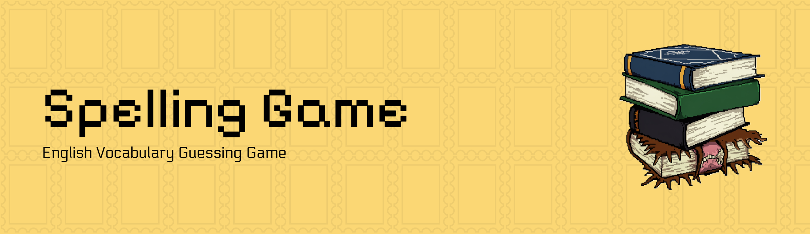

<!-- the title of project -->


# 🧠 Spelling Game Project
The Spelling Game is an interactive web application designed to help users improve their spelling skills in a fun and engaging way. The game offers three levels of difficulty - Easy, Medium, and Hard - each with its own set of words and challenges. The application is built using a combination of HTML, CSS, and JavaScript, with a focus on providing a user-friendly interface and a seamless gaming experience.

## 🚀 Features
- **Multiple Game Levels**: The game offers three levels of difficulty - Easy, Medium, and Hard - each with its own set of words and challenges.
- **Interactive Interface**: The application features a user-friendly interface that allows players to navigate through the game with ease.
- **Audio**: The game includes audio to help players learn the correct pronunciation of words.
- **Hint System**: A hint system is in place to assist players who are struggling with a particular word.
- **Scoring System**: The game features a scoring system that rewards players for correct answers and penalizes them for incorrect ones.
- **Responsive Design**: The application is built using responsive design principles, ensuring that it can be accessed and played on a variety of devices.

## 🛠️ Tech Stack
- **Frontend**: HTML, CSS, and JavaScript
- **Libraries**: Bootstrap CSS and SweetAlert2
- **Storage**: Session storage

## 📦 Installation
To get started with the Spelling Game project, follow these steps:
1. Clone the repository to your local machine.
2. Open the `index.html` file in a web browser to access the game.
3. No additional installation or setup is required.

## 💻 Usage
1. Open the `index.html` file in a web browser.
2. Click on the "Start Game" button to begin playing.
3. Select your desired game level : Easy, Medium, or Hard.
4. Follow the instructions to play the game.

## 📂 Project Structure
```markdown
Spelling-Game/
|-- easy.html
|-- hard.html
|-- index.html
|-- medium.html
|-- README.md
|-- result.html
|-- rules.html
|-- start-game.html
|-- js/
    |-- easy.js
    |-- medium.js
    |-- hard.js
|-- css/
    |-- easy.css
    |-- hard.css
    |-- index.css
    |-- medium.css
    |-- result.css
    |-- rules.css
    |-- start-game.css
|-- img/
    |-- banner.png
    |-- bgEasy.png
    |-- bgHard.png
    |-- bgHome.png
    |-- bgMedium.png
    |-- bgPaper.png
    |-- bgResult.png
    |-- books.png
    |-- easy.png
    |-- hard.png
    |-- medium.png
    |-- score.png
    

